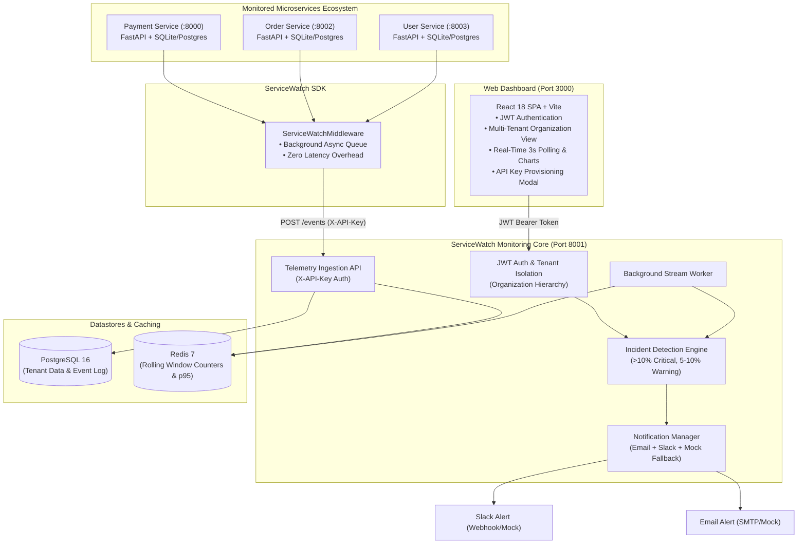

# Errivanta — Enterprise Multi-Tenant Observability Platform

[](https://github.com/errivanta/errivanta/actions)
[](https://www.python.org/)
[](https://fastapi.tiangolo.com)
[](https://www.docker.com/)

**Errivanta** is a real-world, production-ready observability and incident management SaaS platform. It allows engineering teams to connect backend microservices via lightweight Python middleware, automatically capturing request throughput, latencies (p95), error rates, and triggering real-time incident alerting via Email and Slack.

---

## 🏗️ Architecture Overview



---

## 🚀 Key Features by Phase

### Phase 1: Core Telemetry & Payment Service Foundation
- **Payment Service**: Real-world payment processing microservice on port 8000.
- **Monitoring SDK**: Reusable `servicewatch-sdk` with non-blocking FastAPI middleware.
- **Monitoring API**: REST API on port 8001 for ingest and event retrieval.
- **Persistent Storage**: PostgreSQL storage with Alembic migrations and zero-config SQLite fallback.

### Phase 2: Monitoring Intelligence & Real-Time Dashboard
- **Redis Aggregations**: Sliding 1-minute and 5-minute rolling counters, average latency, and p95 calculations.
- **Incident Engine**: Threshold-based incident triggering (>10% CRITICAL, 5-10% WARNING) with deduplication and resolution APIs.
- **Order Service**: Second microservice on port 8002 integrated with SDK telemetry.
- **React Dashboard**: Modern dark-themed SPA on port 3000 with real-time throughput charts and incident resolution.

### Phase 3: Production, Multi-Tenancy & SaaS (Completed)
- **User Service**: Third microservice on port 8003 with user management and failure simulation.
- **JWT Authentication**: Full user registration, login, and password hashing (`bcrypt`/`pbkdf2`).
- **Strict Multi-Tenancy**: Organization hierarchy (`Organization` $\rightarrow$ `Users` $\rightarrow$ `Microservices` $\rightarrow$ `Telemetry` $\rightarrow$ `Incidents`). Strict database-level tenant isolation prevents cross-tenant access.
- **Alerting & Notifications**: Decoupled Email and Slack alerting with anti-spam notification rules (suppresses repeated alerts for ongoing open incidents).
- **Observability**: Deep `/health` endpoint checking PostgreSQL and Redis connectivity.
- **Docker Compose**: Production multi-container orchestration for all 8 services.
- **CI/CD**: GitHub Actions pipeline for automated testing and image building.
- **AWS Blueprint**: Production deployment guide for AWS (Fargate, RDS, ElastiCache, S3/CloudFront).

---

## 🔑 Authentication Architecture

ServiceWatch clearly separates two distinct authentication mechanisms:

1. **Dashboard User Authentication (JWT Bearer Token)**:
   - Dashboard users register/login via `/api/v1/auth/login` and receive a JWT.
   - All dashboard and management endpoints require `Authorization: Bearer <token>` and scope data strictly to the user's `organization_id`.
2. **Monitored Microservice Authentication (`X-API-Key`)**:
   - Backend microservices authenticate telemetry requests via `X-API-Key: sw_live_...`.
   - Each API key binds to a specific microservice and organization.

---

## 💻 Quickstart (Running Locally)

### Option 1: Docker Compose (Recommended)

Run the entire 8-container SaaS platform with one command:

```bash
docker-compose up --build
```

Access the components:
- **Web Dashboard**: [http://localhost:3000](http://localhost:3000) (Login: `admin@servicewatch.io` / `password123`)
- **Monitoring API**: [http://localhost:8001/docs](http://localhost:8001/docs)
- **Payment Service**: [http://localhost:8000/docs](http://localhost:8000/docs)
- **Order Service**: [http://localhost:8002/docs](http://localhost:8002/docs)
- **User Service**: [http://localhost:8003/docs](http://localhost:8003/docs)

---

### Option 2: Local Python Execution

1. **Activate Virtual Environment & Install Dependencies**:
   ```bash
   python -m venv venv
   .\venv\Scripts\Activate.ps1
   pip install -r payment-service/requirements.txt
   pip install -r order-service/requirements.txt
   pip install -r user-service/requirements.txt
   pip install -r monitoring-api/requirements.txt
   pip install -e servicewatch-sdk
   ```

2. **Start Services in Separate Terminals**:
   ```bash
   # Terminal 1: Monitoring API (Port 8001)
   cd monitoring-api && uvicorn app.main:app --port 8001 --reload

   # Terminal 2: Payment Service (Port 8000)
   cd payment-service && uvicorn app.main:app --port 8000 --reload

   # Terminal 3: Order Service (Port 8002)
   cd order-service && uvicorn app.main:app --port 8002 --reload

   # Terminal 4: User Service (Port 8003)
   cd user-service && uvicorn app.main:app --port 8003 --reload

   # Terminal 5: Dashboard (Port 3000)
   cd dashboard && npm run dev
   ```

---

## 🧪 Automated Testing

Run the complete test suite across all packages:

```bash
# Run all tests
cd user-service && pytest -v
cd ../order-service && pytest -v
cd ../payment-service && pytest -v
cd ../servicewatch-sdk && pytest -v
cd ../monitoring-api && pytest -v
```

**Total Test Coverage: 41/41 unit & multi-tenant integration tests PASSED.**

---

## 💥 Demonstrating a Real Failure End-to-End

ServiceWatch detects genuine microservice failures rather than relying on mock events:

### 1. Trigger Genuine Failures in Payment Service
In PowerShell, trigger 10 failing requests:
```powershell
1..10 | ForEach-Object {
    try {
        Invoke-RestMethod -Uri "http://localhost:8000/payments" -Method POST -ContentType "application/json" -Body '{"amount": -50.0, "currency": "USD"}'
    } catch {
        Write-Host "Captured 400 Bad Request" -ForegroundColor Yellow
    }
}
```

### 2. Trigger Simulated 500 Failure in User Service
```powershell
try {
    Invoke-RestMethod -Uri "http://localhost:8003/users/simulate-failure" -Method POST
} catch {
    Write-Host "Captured 500 Internal Server Error" -ForegroundColor Red
}
```

### 3. Observe Results:
1. **Telemetry Capture**: The `ServiceWatchMiddleware` captures the failures and flushes them to `monitoring-api`.
2. **Threshold Violation**: The Redis rolling error rate exceeds 10%.
3. **Incident Creation**: A `CRITICAL` incident is created and visible in the **🚨 Incidents** tab.
4. **Notifications**: The notification manager logs/dispatches rich alerts to Email and Slack.
5. **Deduplication**: Additional errors update the ongoing incident without spamming new alerts.
6. **Resolution**: Click **"✓ Resolve Incident"** on the dashboard to resolve the incident.

---

## ☁️ AWS Deployment Roadmap

For production deployment instructions on AWS (using Amazon ECS Fargate, RDS PostgreSQL Multi-AZ, Amazon ElastiCache Redis, and S3/CloudFront), see [docs/aws_deployment_guide.md](docs/aws_deployment_guide.md).
